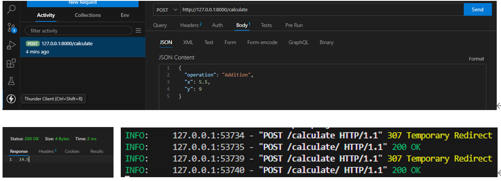

# 簡易整合 streamlit + fastapi

## 環境準備
'''
pip -m venv env
source env\bin\activate [Linux]
env\Scripts\activate [Windows]

pip install -r requirements.txt
'''

## 啟動服務
需開啟 2 terminal，分別啟動FastAPI與Streamlit

'''啟動streamlit
streamlit run streamlit.py
'''
'''啟動fastapi
uvicorn fast_api:app --reload
'''

